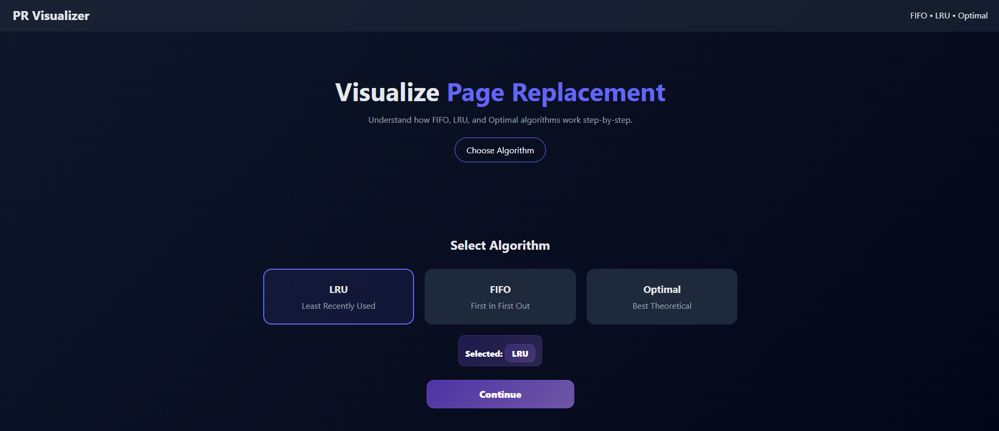
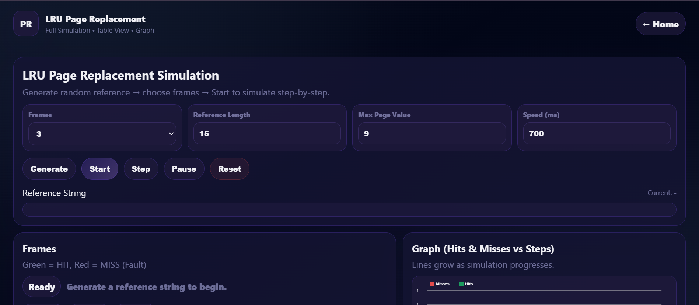
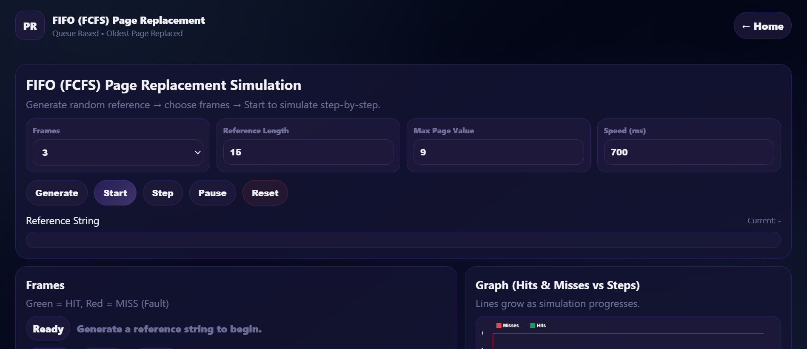
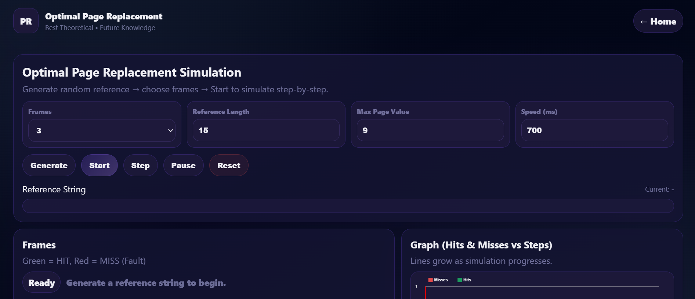

# 🧠 Page Replacement Algorithm Visualizer

An interactive, web-based visualizer that simulates and compares three classic **Operating System page replacement algorithms** — **FIFO**, **LRU**, and **Optimal** — step-by-step, helping students understand memory management concepts through real-time visual feedback.

🔗 **Live Demo:** [page-replace-algo.netlify.app](https://page-replace-algo.netlify.app/)

---

## 📌 Overview

Modern operating systems use virtual memory to manage limited physical memory. When a requested page isn't in memory, a **page fault** occurs, and the OS must decide which page to remove using a page replacement algorithm. This project bridges the gap between textbook theory and real execution by letting users **visually simulate** how FIFO, LRU, and Optimal algorithms behave under identical conditions.

---

## ✨ Features

- 🎯 **Three Algorithms** — FIFO, LRU, and Optimal page replacement
- 📊 **Real-time Graphs** — Hits vs. Misses plotted live as simulation progresses
- 🗂️ **Timeline Table** — Textbook-style frame history for every step
- 📝 **Simulation Log** — Step-by-step explanation of each hit/miss/replacement
- ⚙️ **Configurable Parameters** — Number of frames, reference string length, max page value, and simulation speed
- ▶️ **Step / Auto-run Controls** — Start, pause, step through, or reset the simulation
- 🎨 **Color-coded Frames** — Green for HIT, Red for MISS (page fault)
- 📱 **Responsive UI** — Works smoothly across screen sizes

---

## 🖼️ Screenshots

**Homepage**


**LRU Simulation**


**FIFO Simulation**


**Optimal Simulation**



---

## 🧩 Algorithms Implemented

| Algorithm | Description | Practical Use | Efficiency |
|---|---|---|---|
| **FIFO** | Replaces the oldest page in memory | Yes | Low |
| **LRU** | Replaces the least recently used page | Yes | Good |
| **Optimal** | Replaces the page not needed for the longest future time | No (Theoretical) | Best |

---

## 🛠️ Tech Stack

- **HTML5** — Application structure
- **CSS3** — Styling, layout, animations & responsiveness
- **JavaScript (ES6)** — Core simulation logic, algorithms & interactivity
- **Canvas / DOM Manipulation** — Real-time graphs, tables, and logs

> Fully client-side — no backend required, making it fast and platform-independent.

---

## 🚀 Getting Started (Run Locally)

```bash
# Clone the repository
git clone https://github.com/sujoysarkar02/Page_Replacenment_Algorithm.git

# Navigate into the project folder
cd Page_Replacenment_Algorithm

# Open index.html directly in your browser
# or use a live server extension (recommended)
```

No build tools or dependencies needed — just open `index.html` in any modern browser.

---

## 📈 How It Works

1. Select a page replacement algorithm (FIFO / LRU / Optimal)
2. Configure frames, reference string length, and simulation speed
3. Click **Generate** to create a random reference string
4. Click **Start** (auto-run) or **Step** (manual step-through)
5. Watch memory frames update live with HIT/MISS status, graphs, timeline table, and logs

---

## 🔮 Future Work

- Add more algorithms: **LFU**, **Second Chance**, **Clock**
- Allow manual input of custom reference strings
- Export simulation results as downloadable PDF/report
- Improve mobile responsiveness further

---

## 👤 Author

**Sujoy Sarkar** — Department of CSE, International Islamic University Chittagong (IIUC)

**Contributors:**
- Tanvir Ahammad Riyad
- Dipta Dhor
- Kanon Shil

---

## 📄 License

This project is for academic purposes.

